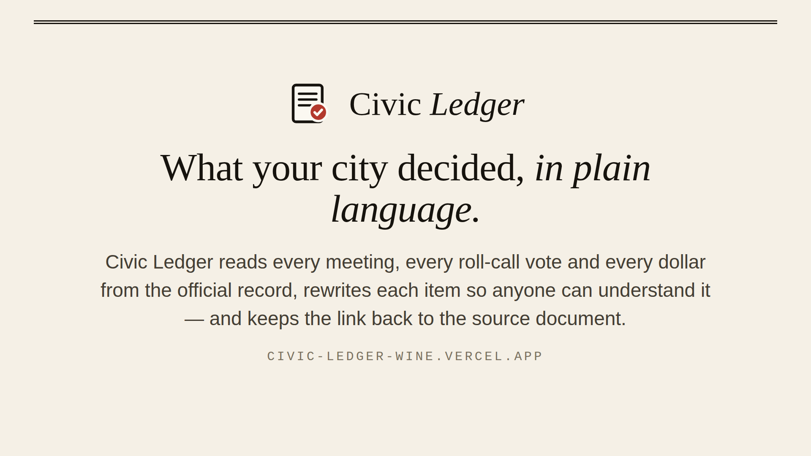

# Civic Ledger

**What your city council decided, in plain language — every vote, every dollar, every meeting, pulled from the public record and explained.**

Council agendas and minutes are public, but they're long, written in legal boilerplate, and scattered across PDFs. Almost nobody reads them. Civic Ledger reads the record for you: it pulls every meeting, every roll-call vote and every dollar figure from the source, rewrites each item in one to three plain sentences, files it under a topic, puts it on a map, and keeps a link back to the original document so you can always check the summary against the source.

Built for **Reverie Hacks 2026** (Software Development track).

- **Live site:** https://civic-ledger-wine.vercel.app
- **Demo video (3 min):** https://youtu.be/75pyH6MbzkI
- **Devpost:** https://devpost.com/software/civic-ledger-nuok92
- **Demo city:** Pittsburgh, PA — 14 council meetings, 345 decisions, ~$156M in authorizations, May–Aug 2026.



---

## What it does

- **Read the record.** For the ~300 US cities and counties on Legistar, Civic Ledger reads meetings, agenda items, roll-call votes by member, sponsors and the full legislative text straight from the public API — nothing scraped. For everyone else, paste any agenda or minutes URL (HTML or PDF) and Firecrawl turns it into clean text on the spot.
- **Explain each item.** An open-weight language model rewrites each ordinance and resolution in plain English, names who it affects and the headline dollar figure, files it under a topic, and pulls out any street address or park. Votes, amounts and dates always come from the record — the model can't invent them, and every summary shows its source.
- **See where the money goes.** A dollars-authorized timeline, a by-topic breakdown, the biggest items that passed, and grants coming in.
- **See how they voted.** A per-member scorecard, every contested (non-unanimous) roll call with the full roll, and who was most often on the losing side.
- **See it on a map.** Items that name a place are geocoded; type your address to see what was decided near you.
- **Ask the record.** A retrieval-grounded chat that answers only from the items in the snapshot and cites them by number — no general-knowledge guessing.
- **Follow a city.** A printable weekly digest and a per-city RSS feed.

## Sponsor tools

- **Firecrawl** — the entire "Read any agenda" feature and city search. Any council's agenda/minutes page, HTML or PDF, is fetched and cleaned by Firecrawl (`/v2/scrape`, `/v2/search`), then read item by item.
- **Featherless AI / open-weight LLM** — plain-language explanations, meeting recaps, live extraction and the Ask feature. The model client is OpenAI-compatible and provider-agnostic (`LLM_BASE_URL`); Featherless is the intended default, and any OpenAI-compatible endpoint works.
- **Render / Vercel** — the app is a static-snapshot Next.js site with a couple of serverless routes, so it deploys to either free tier with no database. A `render.yaml` is included.

---

## How it's built

```
Legistar public API  ─┐
                      ├─►  ingest CLI  ──►  data/cities/<slug>.json  ──►  Next.js (App Router)  ──►  static site
Firecrawl (any URL)  ─┘        │                                              │
                          open-weight LLM                              serverless routes:
                          (explain + classify                          /api/ask, /api/live,
                           + geocode hints)                            /api/find, /api/geocode
```

The design decision that makes it cheap and fast: **all the expensive work happens at build time.** The ingest CLI pulls the record, calls the model once per item, geocodes locations, and writes a plain JSON snapshot per city. The deployed site just reads those snapshots — no database, no per-request model calls except the opt-in Ask and live-reader features. Re-running ingest reuses summaries for unchanged items, so a refresh only pays for what's new.

- **Framework:** Next.js 16 (App Router, RSC), TypeScript, Tailwind v4.
- **Search:** MiniSearch, in-process, for the decision browser and Ask retrieval.
- **Map:** Leaflet + React-Leaflet, CARTO light tiles.
- **Data:** committed JSON snapshots in `data/cities/`. No database.
- **Model client** (`src/lib/llm.ts`): OpenAI-compatible, streaming, JSON-mode with graceful fallback, per-model daily-quota tracking with automatic failover across a list of models.

## Repo layout

```
src/lib/
  types.ts            shared data model
  adapters/legistar.ts  structured pull from the Legistar API
  adapters/web.ts       LLM extraction from an arbitrary agenda/minutes document
  firecrawl.ts        scrape + search, with a keyless fetch/PDF fallback
  llm.ts              OpenAI-compatible chat client (stream, JSON, failover)
  enrich.ts           per-item plain-language rewrite + meeting recaps
  heuristics.ts       rule-based topic/money/district extraction (works with no model)
  geocode.ts          Nominatim geocoding with a local cache
  store.ts / search.ts  snapshot loading, stats, full-text index
scripts/ingest.ts     the build-a-city CLI
src/app/              routes (see below)
data/cities/*.json    committed snapshots
```

Routes: `/` (home) · `/[city]` (overview) · `/[city]/decisions` · `/[city]/decisions/[id]` · `/[city]/meetings/[id]` · `/[city]/money` · `/[city]/votes` · `/[city]/votes/[member]` · `/[city]/map` · `/[city]/digest` · `/[city]/ask` · `/[city]/feed.xml` · `/live` · `/about`.

---

## Run it locally

Requires Node 20+.

```bash
npm install
cp .env.example .env    # then fill in keys (all optional — see below)
npm run dev
```

Open http://localhost:3000. The repo ships with a Pittsburgh snapshot, so it runs with no keys at all.

### Environment variables

All optional. Without them, the committed snapshots still render; you just can't build new ones or use the live/ask features.

| Variable | What it enables |
| --- | --- |
| `LLM_API_KEY` | Plain-language explanations, recaps, Ask, and live extraction. |
| `LLM_BASE_URL` | OpenAI-compatible endpoint. Default `https://api.featherless.ai/v1`. For Groq: `https://api.groq.com/openai/v1`. |
| `LLM_MODELS` | Comma-separated model list; the client fails over as daily quotas run out. e.g. `llama-3.3-70b-versatile,openai/gpt-oss-120b`. |
| `FIRECRAWL_API_KEY` | The "Read any agenda" feature and city search. |
| `NEXT_PUBLIC_SITE_URL` | Absolute URLs in RSS and Open Graph. |

### Build or refresh a city

```bash
npm run ingest -- --list                                   # cities the CLI knows
npm run ingest -- --city pittsburgh --from 2026-05-15 --to 2026-08-16
npm run ingest -- --city madison --no-llm                  # structure only, no model
```

Adding a Legistar city is one entry in `src/lib/cities.ts` (the client slug is the subdomain of its `*.legistar.com` site) plus one `ingest` run. The snapshot lands in `data/cities/<slug>.json`; commit it and deploy.

---

## Deploy

**Vercel:** import the repo; it builds with zero config. Add `LLM_*` and `FIRECRAWL_API_KEY` if you want Ask and the live reader in production. Snapshots are committed, so the build needs no keys.

**Render:** the included `render.yaml` provisions a Node web service (`npm run build` / `npm start`). Set the same environment variables in the dashboard.

---

## Honest limits

Civic Ledger is a reading aid, not an official record. It's careful about the line between the two.

- **Dollar figures** are the largest amount named in an item — an index of council activity, not an audited budget. An amendment that restates a contract's total counts again; multi-year totals count once. Only items that *passed* are summed.
- **Topic labels** are the model's judgement (rule-based when no model is configured).
- **Map pins** exist only when the record names a street address, intersection or park; citywide items have none.
- **Member sponsorship** is matched by surname and can miscount members who share a name.
- **The live reader** reads a bounded slice of very long documents within the serverless time limit; the CLI has no such cap.
- Every item page shows the **source excerpt** and links to the **original file** so any summary can be checked against the record.

More detail is on the in-app [How it works](/about) page.

## License

MIT. Meeting data belongs to the respective cities and is used under their open-records/public-API terms. Map tiles © OpenStreetMap contributors, © CARTO.
